<h1 align="center">
  
</h1>

  
  
  
  

### 👨‍💻 About Me

I'm a **Computer Engineering graduate** (CESUPA) and **Full Stack Developer** who builds applications end to end — from architecture decisions to deployment. I bring a systematic, engineering-driven approach to software.

- 🔭 Building **web, desktop and mobile** applications with **TypeScript**, **React** and **Node.js**
- 🧾 Integrating **Brazilian tax APIs** (SEFAZ — NF-e, CT-e, MDF-e) into production systems
- 🐍 Automating workflows and extracting insights with **Python**
- 🏆 **3rd place at Amazon Hacking 2025** as Lead Developer — backed by Vale, Accenture and Wipro
- 📐 My engineering background shapes how I think about scalability, maintainability, and impact
- 🤝 Open to collaboration and always eager to learn

### 🛠️ Tech Stack

  
   
  

<table align="center">
  <tr>
    <td align="center"><b>Frontend</b></td>
    <td>React · TypeScript · Tailwind CSS · Next.js</td>
  </tr>
  <tr>
    <td align="center"><b>Backend</b></td>
    <td>Node.js · Python · REST APIs · SEFAZ integrations</td>
  </tr>
  <tr>
    <td align="center"><b>Data</b></td>
    <td>PostgreSQL · Prisma · SQL</td>
  </tr>
  <tr>
    <td align="center"><b>Desktop &amp; Mobile</b></td>
    <td>Electron · React Native · Expo · Tauri</td>
  </tr>
  <tr>
    <td align="center"><b>Infra</b></td>
    <td>Docker · Git · Linux · CI/CD</td>
  </tr>
</table>

### 📊 GitHub Stats

  
  

  

<!-- grafico de contribuicoes: dados reais da API, quadrado a quadrado.
     Regerado todo dia por .github/workflows/update-contributions.yml -->

  

### 🏆 GitHub Trophies

  

  <i>"Engineering is not just about solving problems — it's about solving the right problems, well."</i>

